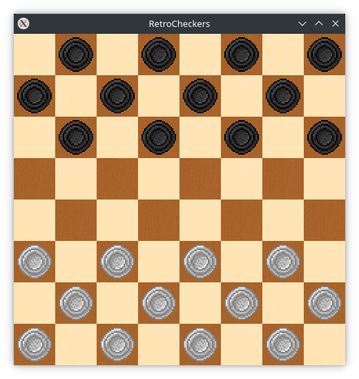

<h2>About the project</h2>
This is my first game, is a implementation of a simple Checkers game 8x8 with a capture optional. I chose work with C++ and SFML to learn about the tecnology.

<h2>Technical Specification</h2>
Because this is my firt work with game development and SFML I made some decisions about how code this game.
<ul>
<li>
    About the fact this is a very small game, I don't judge necessary use smartPointers. 
</li>
<li>
    To make the implementation easy I just think about make a simple code. Because the nature of this work some questions like Premature Optamization and Coupling was used. 
</li>
<li>
    This is not a code make to be the better project possible, have some problems, but how mencioned above some of these "problems" are just implementation choices. 
</li>
</ul>
<h2>Bugs</h2>
In my tests I find just two bugs:

<ol>
<li>Sometimes the piece disappear and sometimes the king can't capture a stone.</li>
<li></li>
</ol>

<h2> My Environment </h2>
<ul>
<li> C++ 17
<li> SFML 2.5
</ul>

<h2>How to build</h2>
This was build in my Linux machine with SFML installed in system, but will be more ways to run this project in your machine. Bellow are the way I like to use because the executable are in a seperate folder.

<code>
g++  Game/sources/*.cpp   -c main.cpp  && g++ *.o -o Build/program -lsfml-graphics -lsfml-window -lsfml-system && ./Build/program && rm *.o
</code> 

<h2>Final result</h2>

